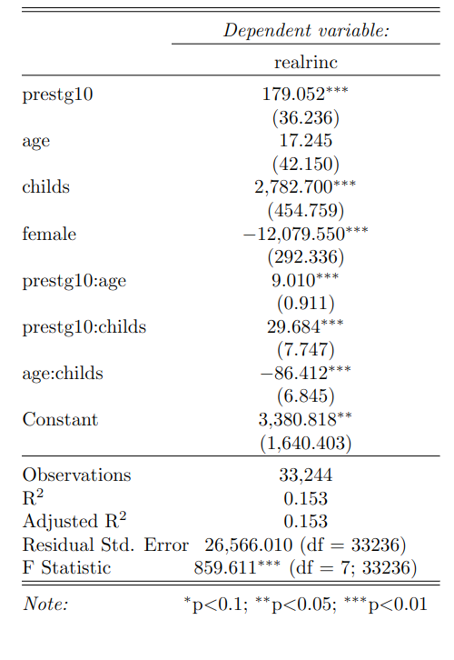
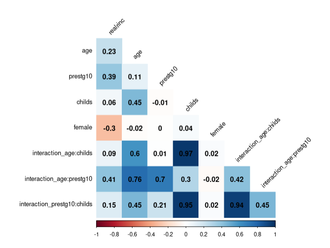

<!-- % Template Version 1.1 -->

<!-- below function does some formatting for images; leave this untouched unless you know better :-) -->


# Introduction

In this paper we predict individuals' wages using data from the General
Social Survey (GSS, 1974-2018). The variable of interest is `realrinc`
which varies between 227\$ and
480,145\$\footnote{In constant 1986 USD.}. Hence, we can use regression
techniques to predict individuals' wages. Additionally, we can consider
whether `realrinc` varies by gender and if so, how much.

The data from the GSS allow us to consider various control variables
such as gender, age, education, occupation, number of children and
marital status.

The prediction of individuals' wages has been an issue in previous
literature. As wages are relevant to companies they want to know how
predict wages [@Chakraborti]. Some papers make use of classification
techniques to predict wages [@Chakraborti]. As we have numeric values of
real wages and not a categorical variable we do not make use of
classification techniques but prefer linear regression techniques such
as OLS and Lasso regressions as well as random forests. We prefer these
techniques as they handle categorical variables and outliers well, which
are features of our data [@Cutler]. Wages were already predicted using
random forests by [@Eichinger]. They find that using random forests
results in better predictions than using linear models. Additionally,
they show that gender barely effects the wage predictions.

Based on the previous literature, we use several regression techniques
to predict `realrinc`:

-   Linear Regression

-   Logistic Regression

-   Lasso, Ridge and Elastic Net Regression

-   Gradient Boosting

-   Random Forest

In order to evaluate which of the regression techniques predicts
`realrinc` the best we split the data set into a train (70%) and a test
(30%) data set. We fit the aforementioned regression models on the train
data and evaluate the root mean squared error (RMSE) using the
validation data. We choose the RMSE as it is more sensitive to large
errors [@Arour].

[Write something about cross validation?]

# Data Preparation & Feature Engineering

The initial data set contains 11 variables, which are described in the
following: - **year**: survey year - **realrinc**: respondent's base
income (in constant 1986 USD) - **age**: respondent's age in years -
**occ10**: respondent's occupation code - **occrecode**: recode of the
occupation code into one of 11 main categories - **prestg10**:
respondent's occupational prestige score - **childs**: number of
children - **wrkstat**: work status of the respondent (full-time,
part-time, temporarily not working, unemployed (laid off), etc.) -
**gender**: respondent's gender - **educcat**: respondent's degree level
(Less Than High School, High School, etc.) - **maritalcat**:
respondent's marital status (Married, Widowed, Divorced, etc.)

## Data Preparation

Before modeling we prepared the data. The initial data set has 54,842
observations and the outcome variable `realrinc` has 38.55% of missing
values. The imputation of the target variable was discarded to avoid
generating a bias in the modeling and therefore we decided to eliminate
these records from the original data set. After this, the data set
contains 33,702 observations. Furthermore, it was impossible to deduce
the occupation for some observations (`occ10 = 9997`) and these are
removed from the data set. At the end, the final data set has 33,244
observations, and is used for the modeling process.

This data set still has some missing values for the regressors, e.g.,
number of children, age, marital status, degree level, and others. Using
the `mice` package we conduct the imputation using five variables. We
impute the features *age, occupational prestige and number of children*
using the pmm (`predictive mean matching`) method. The polytomous
logistic regression method is used for the factor variables (*education
and marital status*). The imputation process uses a number of multiple
imputations of six. This means that the imputation process creates 6
different data sets, and then the estimation of the mean and the
majority vote is applied to aggregate the data sets into a single data
set. The mean estimation is applied for numeric variables and majority
vote for categorical variables..

## Feature Engineering

After the imputation process we create interaction variables. First,
some interaction features are estimated using only the numerical
variables, and then we transform the numerical variables into
categorical variables by dividing them into different ranges (e.g. age
between 18 and 30, age between 31 and 50, etc). These new categorical
variables and the initial categorical variables (*marital status,
education, etc*) are transformed into dummy variables. And finally, we
estimate the interaction variables with the group of dummy variables
mentioned above. We validate the inclusion of the interaction of the
numeric variables using a linear model. The results show that the
p-values of the parameters for the interactions are less than 0.05.



Furthermore, we estimate a correlation matrix using Spearman's rank
correlation coefficient with some numeric variables in order to support
the previous results. The correlation results are shown in the following
figure.



After the data preparation and feature engineering processes, we
construct a final data set with 33,244 observations and 421 features.
Due to the large number of interaction variables, we decided to reduce
them and use only the interaction between a group of variables
(*occrecode, educcat and prestg10*). After reduction, the modeling
process is developed with 100 variables (numerical and interaction
variables). The following figure shows the overview of the group of
variables that we estimated and used in the models.


# Model Training and Tuning

We use five different regression techniques to predict the individuals'
wages using the final dataset. We fit every model on our training data
using the `train` function from the `caret` package. To choose the best
parameter combination we use cross-validation within all train
functions.

## Linear and Logistic Regression

Our baseline linear model uses an OLS regression including all
interaction variables. This results in an RMSE of 25,506.05.

``` r
formula <- as.formula(paste("realrinc ~", paste(x_cols_dummys, collapse = " + ")))
mod_full <- train(formula,
                  data = train, 
                  method = "lm",  
                  trControl = trainControl(method = "cv"))
```

Given some extreme outliers in the income distribution of our data
(which is typical for wage data) we follow the economic literature
[@Ermini] and fit a logistic model to our data, using the log of
`realrinc` as our dependent variable. This results in a higher RMSE than
the linear model (25,909.82).

``` r
formula2 <- as.formula(paste("log_realrinc ~", paste(x_cols_dummys, collapse = " + ")))
mod_loginc <- train(formula2,
                    data = train, 
                    method = "lm",  
                    trControl = trainControl(method = "cv"))
```

In both models the coefficient of female is statistically significant
with p \< 0.001. It suggests that being female decreases the real income
by approximately 10,192\$ in the linear model or by 40% in the logistic
model.

## Subset Selection

As the dataset contains many variables (361) and even our selection of
dummy variables for the right-hand side of the regression leaves us with
53 variables, we make use of regression techniques for subset selection.
We use lasso, ridge and elastic net regressions. These methods allow us
to fit a model that contains all variables. Then the model regularizes
the coefficient estimates and shrinks them towards zero. In effect, we
reduce the estimates' variance which improves the model fit.

We start with a ridge regression.

$$
RSS + \lambda \sum^p _{j=1} \beta^2_j 
$$

Hence, the coefficient estimates in a ridge regression minimize the sum
of the residual sum of squares (RSS) and the sum of squared coefficients
multiplied with a tuning parameter $\lambda$. We estimate $\lambda$
using cross-validation.

``` r
ridge <- train(formula, data = train,
  method = "glmnet", trControl = trainControl(method = "cv"),
  tuneGrid = expand.grid(alpha = 0, lambda = seq(0, 500, 1))) 
```

Perform a ridge regression to predict real incomes yields an RMSE of
25,524.85.

In contrast to other subset selection methods ridge regression does not
exclude any variables from the regression model. Hence, the model is
still fitted on 53 covariates. To overcome this issue we also use a
lasso regression.

$$
RSS + \lambda \sum^p_{j=1} | \beta_j |
$$

In contrast to the ridge regression the lasso regression forces some of
the coefficient estimates to be equal to zero if $\lambda$ is
sufficiently large. Hence, the regression is not performed on all
covariates.

``` r
lasso <- train(formula, data = train, 
       method = "glmnet", trControl = trainControl(method = "cv"), 
       tuneGrid = expand.grid(alpha = 1, lambda = seq(0,500,1)))
```

To perform the lasso regression in `R` we set $\alpha$ equal to one. The
lasso regression yields a lower RMSE than the ridge regression
(25,504.58 vs. 25,524.85) and even a lower RMSE than the linear
regression.

In a final step we use elastic net regularization which is a linear
combination of ridge and lasso regression. The elastic net
regularization allows $\alpha$ to vary between zero and one. This
results in an RMSE of 25,241.7.

``` r
elasticnet <- train(formula, data = train,
       method = "glmnet", trControl = trainControl(method = "cv"),
       tuneGrid = expand.grid(alpha = seq(from=0, to=1, by = 0.1),
       lambda = seq(from=0, to=0.15, by = 0.001)))
```
